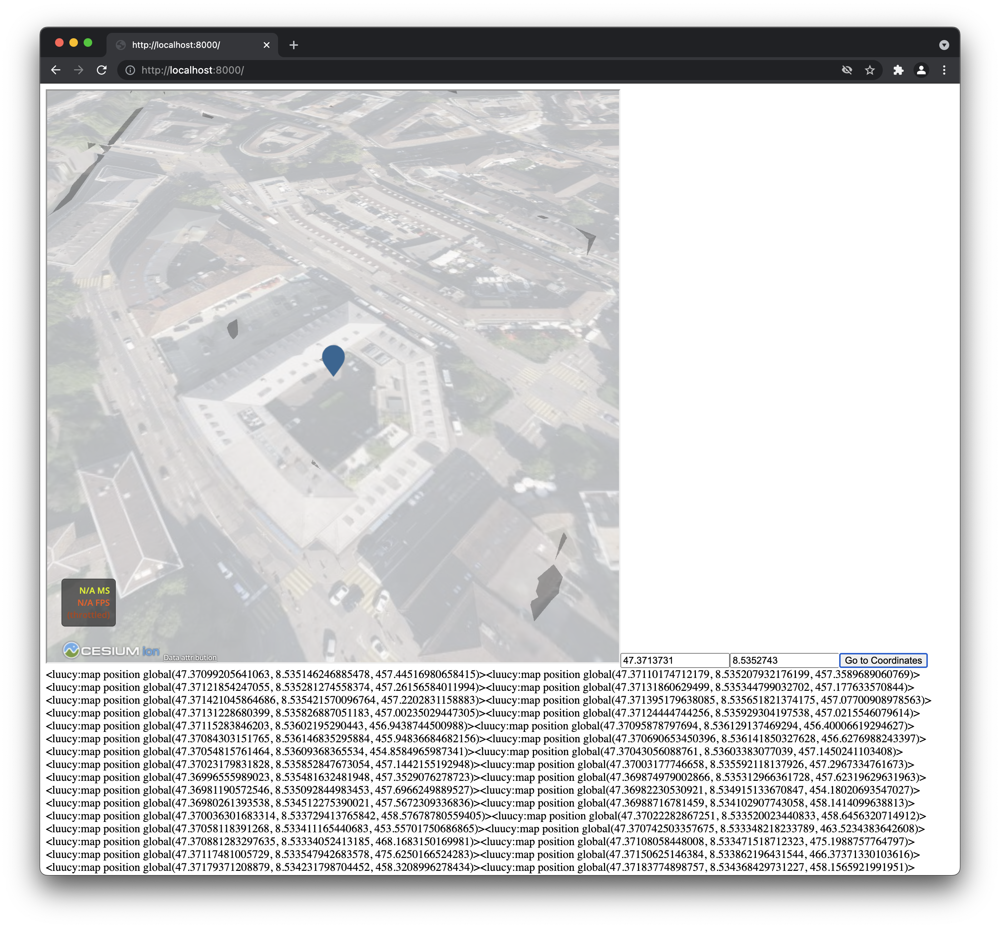

# Sample HTML + JS App



> **Warning**
> You'll need to allow 3rd party cookies to debug a embedded plugin.
> This is not required after deploying your plugin :D

Add `luucy-embed` as a npm dependency to your project - or include it form a CDN

```bash
npm install luucy-embed
```

In this example, we will make an app that allows users to input a coordinate and move to the coordinate in luucy
And the plugin will report location changes to your webpage

```html
<!doctype html>
<html>
  <head>
    <style>
      iframe {
        width: 800px;
        height: 800px;
      }
    </style>
  </head>

  <body>
    <script type="module">
      // import luucy from CDN
      import { Luucy } from 'https://unpkg.com/luucy-embed@1.0.4/index.js';

      // create the connection
      // you need to define a name for your app, try to use something unique
      // specify your workspace & project id & variant id (optional)
      const luucy = new Luucy('sample-embed-plugin', 'LUUCY_Testing_LUUCY_Embed_Sample', 10273);

      // add the luucy embedded page (it's an iframe) to the body element
      luucy.embed(document.body).then(() => {
        // create an input field for the latitude
        const latitude = document.createElement('input');
        latitude.type = 'number';
        latitude.value = '47.3713731';
        document.body.appendChild(latitude);

        // and one for the longitude
        const longitude = document.createElement('input');
        longitude.type = 'number';
        longitude.value = '8.5342743';
        document.body.appendChild(longitude);

        // finally a button which will send the coordinates to your plugin
        const button = document.createElement('button');
        button.textContent = 'Go to Coordinates';

        // send the coordinates! you can pass anything JSON serializeable to your plugin
        button.onclick = () =>
          luucy.sendMessage({
            latitude: latitude.valueAsNumber,
            longitude: longitude.valueAsNumber
          });

        document.body.appendChild(button);
      });

      // wait for messages from your plugin
      luucy.onmessage = (message) => {
        document.body.appendChild(document.createTextNode(JSON.stringify(message)));
      };
    </script>
  </body>
</html>
```

And now create a plugin (using the [CLI](https://github.com/luucyadmin/luucy-cli)) and add the following code

```typescript
// enable fullscreen mode
// this will hide all the luucy ui stuff
// requires ui (luucy add ui)
ui.fullscreen.enable();
console.log('sample-embed-plugin is running');

// connect to your application
// warning: this will fail (fo ro catch below) when luucy is not beeing embedded
embed
  .connect('sample-embed-plugin')
  .then((app) => {
    // send location changes of the map to your webpage
    // requires map.location (luucy add map.location)
    map.location.onCenterChange.subscribe((center) => {
      const message = { position: { lat: center.latitude, lng: center.longitude, height: center.height } };
      console.log('[onCenterChange] sending update', message);
      app.sendMessage(message);
    });

    // wait for messages from your page ()eg. when you click the button
    app.onMessage.subscribe((message) => {
      // create a global position (WGS84) from the supplied positions
      console.log('[onMessage] received update', message);
      const position = new GlobalPosition(message.latitude, message.longitude);

      // create a marker at the specified location
      // requires map (luucy add map)
      const marker = new map.Marker(position);

      // focus the marker (moves the map to the marker)
      marker.focus();
    });
  })
  .catch((error) => {
    // show notification when the plugion could not connect!
    console.error('Not running in an embedded context:', error);
    // new ui.Notification(ui.danger, error + '').show(false);
  });
```
